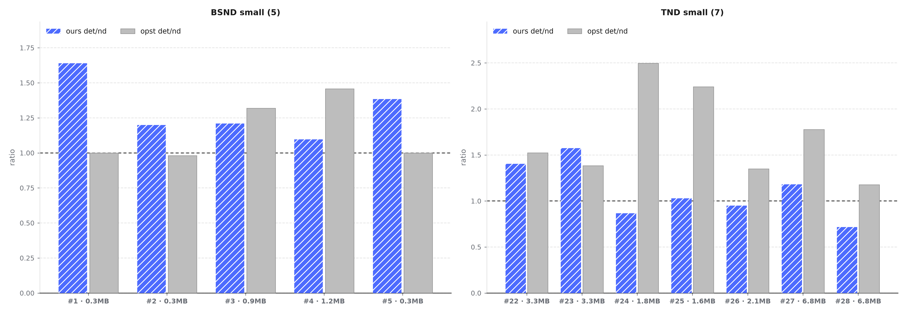
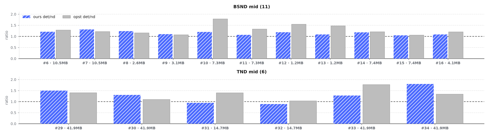
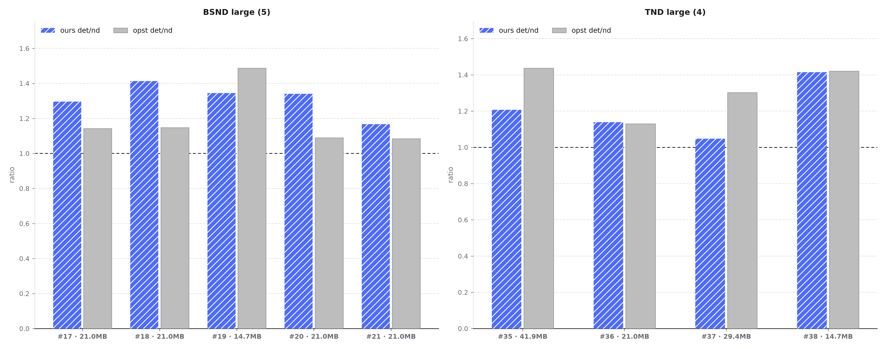
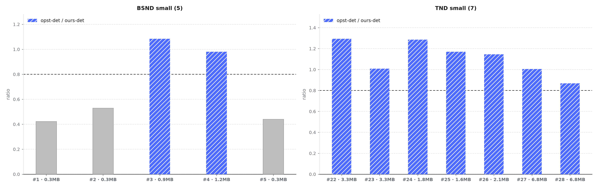
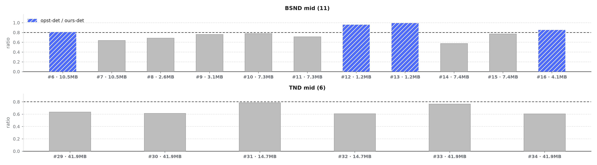
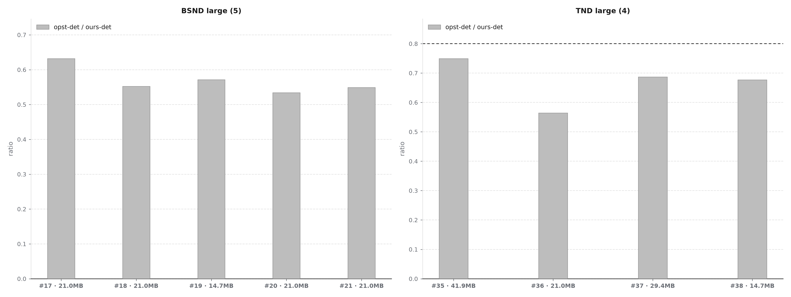
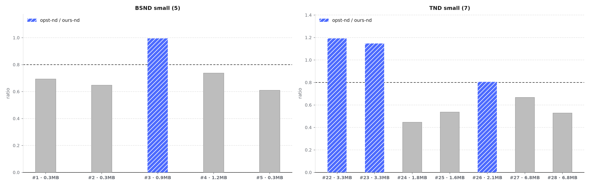
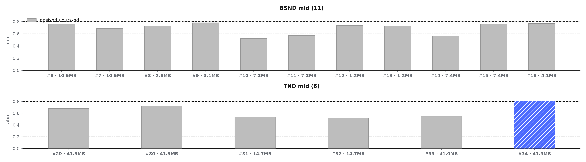
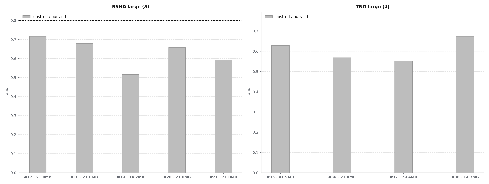

# PR：确定性反向（BN2S2 + TND causal 调度）性能对比与分析

源分支：`det-cmp-v3-swizzle`（HEAD `02c043b`）
目标分支：`integration/FAG-V3-A5`（基线 `13e835c`「cube Optimize」已并入，PR 无冲突）

## Related Issue

支持 FAG v3（Ascend950）反向的**确定性分支**（deterministic bwd）：补齐 TND
causal 专用调度与 TND ragged flat 分区，并完成与 ops-transformer（opst）的性能
对齐。（仓库内无对应 issue 编号）

## Summary

本 PR 让 `deterministic=True` 的反向覆盖下列布局，并给出与 ops-transformer 的
达标情况。口径：msprof device 侧 kernel 时间（`Task Duration`），**median of 25**
（warmup 5 + repeat 20）；比值 = opst / 本实现，**≥0.8 达标**。

**支持的布局**

| 维度 | 覆盖 |
|---|---|
| layout | BSND（dense / causal）、TND（dense / causal，含 ragged / 不等长分段） |
| head 结构 | MHA / GQA / MQA（n2 = 1~8，g = 1~4） |
| head dim | 64 / 128 |
| 形状 | 方阵、矩形（sq ≠ sk）、非对齐尺寸（如 33×77）、奇 batch |
| 前提 | `deterministic=True` 走 BN2S2 调度（`mha_bwd.cpp` 显式校验） |

**每种布局的性能达标情况**（38 case = BSND 21 + TND 17）

| layout | 确定性 vs 确定性 | 小 shape | 中 shape | 大 shape | 非确定性 vs 非确定性 | 确定性开销 ours / opst |
|---|---|---|---|---|---|---|
| BSND | 0.683（29%） | 0.637（40%） | 0.767（36%） | 0.567（0%） | 0.681（5%） | 1.222 / 1.226 |
| TND | **0.819（41%）** | **1.101（100%）** | 0.665（0%） | 0.666（0%） | 0.655（24%） | **1.158 / 1.447** |
| 合计 | 0.741（34%） | — | — | — | 0.669（13%） | **1.193 / 1.320**（23/38 个开销 ≤ opst） |

一句话：确定性开销整体优于 opst（1.193 vs 1.320）；确定性核时 TND 整体达标
（0.819，小档 100%），BSND 小档 40%、中/大档仍有差距（0.57–0.77）；非确定性
路径的差距来自既有主流水，与本 PR 的确定性改动无关（分 pipe 归因见 Validation）。

## Validation

### 性能对比：确定性开销

倍率 = det 核时 / nd 核时（>1 = det 更慢）；虚线 = 1.0；横轴 = case 序号 · 数据量
（MB）。加粗 = 双方更优的 det / nd 核时。

| 小 shape | 中 shape | 大 shape |
|---|---|---|
|  |  |  |

| 分组 | case 数 | 小 shape | 中 shape | 大 shape |
|---|---:|---:|---:|---:|
| BSND | 21 | 1.293 / 1.135 | 1.154 / 1.290 | 1.310 / 1.182 |
| TND | 17 | 1.068 / 1.650 | 1.248 / 1.321 | 1.195 / 1.317 |

跨档合并（38 case）：ours **1.193** / opst 1.320；逐 case 比较 **23/38** 个本实现开销 ≤ opst。

### 性能对比：确定性 vs 确定性

比值 = opst / 本实现（≥0.8 达标，<0.8 的柱标灰）；虚线 = 0.8 目标线。

| 小 shape | 中 shape | 大 shape |
|---|---|---|
|  |  |  |

| 分组 | case 数 | 小 shape | 中 shape | 大 shape |
|---|---:|---:|---:|---:|
| BSND | 21 | 0.637（40%） | 0.767（36%） | 0.567（0%） |
| TND | 17 | 1.101（100%） | 0.665（0%） | 0.666（0%） |

### 性能对比：非确定性 vs 非确定性

比值 = opst-nd / 本实现-nd（≥0.8 达标）；该差距为目标主流水既有问题，与本 PR 的
确定性改动无关。

| 小 shape | 中 shape | 大 shape |
|---|---|---|
|  |  |  |

| 分组 | case 数 | 小 shape | 中 shape | 大 shape |
|---|---:|---:|---:|---:|
| BSND | 21 | 0.725（20%） | 0.686（0%） | 0.628（0%） |
| TND | 17 | 0.713（43%） | 0.628（17%） | 0.604（0%） |

### vs. ops-transformer 性能对比明细

逐 case 全矩阵（核时 µs，median of 25）；`ours det/nd` 与 `opst det/nd` 为
确定性开销倍率，`det ratio` / `nd ratio` = opst / 本实现；空值 = opst 无法运行
（TND causal 要求 mask Skv = 2048）。

| # | case | shape (b n g s2 s1 d causal/non-causal) | ours det | ours nd | opst det | opst nd | ours det/nd | opst det/nd | det ratio | nd ratio |
|---|---|---|---:|---:|---:|---:|---:|---:|---:|---:|
| 1 | bsnd_small_mha_causal | b1 n2 g1 s2=128 s1=128 d128 causal | 24.6 | 15.0 | 10.4 | 10.4 | 1.64 | 1.00 | 0.42 | 0.69 |
| 2 | bsnd_small_mha_nc | b1 n2 g1 s2=128 s1=128 d128 non-causal | 18.7 | 15.6 | 9.9 | 10.1 | 1.19 | 0.98 | 0.52 | 0.64 |
| 3 | bsnd_small_gqa_tail_causal | b2 n2 g2 s2=300 s1=200 d64 causal | 24.8 | 20.5 | 26.9 | 20.4 | 1.20 | 1.31 | 1.08 | 0.99 |
| 4 | bsnd_small_mqa_tail_nc | b2 n1 g4 s2=500 s1=300 d64 non-causal | 35.1 | 32.0 | 34.4 | 23.6 | 1.09 | 1.45 | 0.98 | 0.73 |
| 5 | bsnd_tiny_unaligned_causal | b2 n4 g1 s2=77 s1=33 d64 causal | 20.2 | 14.6 | 8.9 | 8.9 | 1.38 | 1.00 | 0.44 | 0.60 |
| 6 | bsnd_mid_mha_square_causal | b1 n8 g1 s2=1024 s1=1024 d128 causal | 75.6 | 62.4 | 61.1 | 47.5 | 1.21 | 1.28 | 0.80 | 0.76 |
| 7 | bsnd_mid_mha_square_nc | b1 n8 g1 s2=1024 s1=1024 d128 non-causal | 112.1 | 85.2 | 71.5 | 58.6 | 1.31 | 1.22 | 0.63 | 0.68 |
| 8 | bsnd_mid_mha_rect_causal | b2 n4 g1 s2=777 s1=333 d64 causal | 38.9 | 31.5 | 26.7 | 23.0 | 1.23 | 1.16 | 0.68 | 0.73 |
| 9 | bsnd_mid_mha_rect_nc | b2 n4 g1 s2=333 s1=777 d64 non-causal | 37.5 | 34.1 | 28.6 | 26.6 | 1.09 | 1.07 | 0.76 | 0.78 |
| 10 | bsnd_mid_gqa_square_causal | b1 n2 g4 s2=1024 s1=1024 d128 causal | 98.7 | 82.2 | 77.0 | 43.1 | 1.20 | 1.78 | 0.78 | 0.52 |
| 11 | bsnd_mid_gqa_square_nc | b1 n2 g4 s2=1024 s1=1024 d128 non-causal | 104.8 | 97.8 | 74.8 | 56.1 | 1.07 | 1.33 | 0.71 | 0.57 |
| 12 | bsnd_mid_mqa_causal | b2 n1 g4 s2=500 s1=300 d64 causal | 36.5 | 30.7 | 35.0 | 22.6 | 1.18 | 1.54 | 0.95 | 0.73 |
| 13 | bsnd_mid_mqa_nc | b2 n1 g4 s2=500 s1=300 d64 non-causal | 35.0 | 32.2 | 34.7 | 23.5 | 1.08 | 1.47 | 0.99 | 0.72 |
| 14 | bsnd_mid_gqa_rect_causal | b2 n3 g2 s2=900 s1=500 d128 causal | 67.4 | 57.0 | 38.9 | 32.2 | 1.18 | 1.20 | 0.57 | 0.56 |
| 15 | bsnd_mid_gqa_rect_nc | b2 n3 g2 s2=900 s1=500 d128 non-causal | 66.3 | 63.4 | 51.1 | 48.1 | 1.04 | 1.06 | 0.77 | 0.75 |
| 16 | bsnd_mid_mha_hd64_nc | b2 n3 g2 s2=333 s1=777 d64 non-causal | 43.8 | 40.3 | 37.3 | 30.9 | 1.08 | 1.20 | 0.85 | 0.76 |
| 17 | bsnd_long_mha_causal | b1 n8 g1 s2=2048 s1=2048 d128 causal | 189.9 | 146.5 | 120.0 | 105.0 | 1.29 | 1.14 | 0.63 | 0.71 |
| 18 | bsnd_long_mha_nc | b1 n8 g1 s2=2048 s1=2048 d128 non-causal | 324.0 | 229.3 | 178.9 | 155.9 | 1.41 | 1.14 | 0.55 | 0.67 |
| 19 | bsnd_long_gqa_causal | b1 n2 g4 s2=2048 s1=2048 d128 causal | 248.5 | 184.8 | 142.0 | 95.5 | 1.34 | 1.48 | 0.57 | 0.51 |
| 20 | bsnd_large_mha_causal | b1 n4 g1 s2=4096 s1=4096 d128 causal | 335.8 | 250.4 | 179.4 | 164.6 | 1.34 | 1.08 | 0.53 | 0.65 |
| 21 | bsnd_large_mha_nc | b1 n4 g1 s2=4096 s1=4096 d128 non-causal | 551.7 | 472.4 | 303.0 | 279.5 | 1.16 | 1.08 | 0.54 | 0.59 |
| 22 | tnd_small_mha_causal | b2 n4 g1 s2=256+384 s1=256+384 d128 causal | 29.9 | 21.3 | 38.7 | 25.4 | 1.40 | 1.52 | 1.29 | 1.19 |
| 23 | tnd_small_mha_nc | b2 n4 g1 s2=256+384 s1=256+384 d128 non-causal | 36.5 | 23.2 | 36.8 | 26.6 | 1.57 | 1.38 | 1.00 | 1.14 |
| 24 | tnd_ragged_mqa_causal | b2 n1 g4 s2=300+1300 s1=100+800 d64 causal | 56.7 | 65.4 | 72.9 | 29.2 | 0.86 | 2.49 | 1.28 | 0.44 |
| 25 | tnd_ragged_mqa_nc | b2 n1 g4 s2=300+400 s1=100+800 d64 non-causal | 53.4 | 51.9 | 62.5 | 27.9 | 1.02 | 2.24 | 1.17 | 0.53 |
| 26 | tnd_ragged_mha_nc | b2 n4 g1 s2=300+400 s1=100+800 d64 non-causal | 33.7 | 35.5 | 38.6 | 28.6 | 0.94 | 1.34 | 1.14 | 0.80 |
| 27 | tnd_ragged_gqa_causal | b2 n2 g2 s2=768+1280 s1=512+1024 d128 causal | 66.0 | 55.9 | 66.3 | 37.3 | 1.18 | 1.77 | 1.00 | 0.66 |
| 28 | tnd_ragged_gqa_nc | b2 n2 g2 s2=768+1280 s1=512+1024 d128 non-causal | 68.3 | 95.3 | 59.3 | 50.4 | 0.71 | 1.17 | 0.86 | 0.52 |
| 29 | tnd_eq_mha_causal | b2 n8 g1 s2=2048 s1=2048 d128 causal | 404.2 | 269.4 | 256.8 | 183.2 | 1.50 | 1.40 | 0.63 | 0.68 |
| 30 | tnd_eq_mha_nc | b2 n8 g1 s2=2048 s1=2048 d128 non-causal | 602.6 | 462.2 | 369.7 | 336.0 | 1.30 | 1.10 | 0.61 | 0.72 |
| 31 | tnd_eq_gqa_causal | b2 n2 g4 s2=1024 s1=1024 d128 causal | 114.0 | 120.5 | 89.6 | 64.1 | 0.94 | 1.39 | 0.78 | 0.53 |
| 32 | tnd_eq_gqa_nc | b2 n2 g4 s2=1024 s1=1024 d128 non-causal | 152.4 | 171.3 | 92.7 | 89.4 | 0.88 | 1.03 | 0.60 | 0.52 |
| 33 | tnd_pack8_mha_causal | b8 n8 g1 s2=512 s1=512 d128 causal | 188.6 | 148.0 | 144.2 | 81.3 | 1.27 | 1.77 | 0.76 | 0.54 |
| 34 | tnd_pack8_mha_nc | b8 n8 g1 s2=512 s1=512 d128 non-causal | 304.7 | 169.5 | 184.3 | 137.3 | 1.79 | 1.34 | 0.60 | 0.81 |
| 35 | tnd_large4_mha_causal | b4 n4 g1 s2=2048 s1=2048 d128 causal | 335.0 | 277.5 | 251.0 | 174.7 | 1.20 | 1.43 | 0.74 | 0.62 |
| 36 | tnd_large_mha_nc | b1 n4 g1 s2=4096 s1=4096 d128 non-causal | 543.2 | 476.9 | 306.6 | 271.3 | 1.13 | 1.13 | 0.56 | 0.56 |
| 37 | tnd_large4_gqa_causal | b4 n2 g4 s2=1024 s1=1024 d128 causal | 211.8 | 202.1 | 145.5 | 111.7 | 1.04 | 1.30 | 0.68 | 0.55 |
| 38 | tnd_large4_mqa_causal | b4 n1 g4 s2=2048 s1=2048 d64 causal | 279.1 | 197.3 | 189.0 | 133.0 | 1.41 | 1.42 | 0.67 | 0.67 |
| GM | BSND |  | 70.9 | 58.0 | 48.4 | 39.5 | 1.22 | 1.23 | 0.68 | 0.68 |
| pass | BSND |  |  |  |  |  |  |  | 29% | 5% |
| GM | TND |  | 133.2 | 115.0 | 109.1 | 75.4 | 1.16 | 1.45 | 0.82 | 0.66 |
| pass | TND |  |  |  |  |  |  |  | 41% | 24% |

### Profiling：BSND（0.26MB → 41.9MB，五档典型案例）

shape：1) 0.26MB 2×33×77 H4/4 D64 causal　2) 0.33MB 1×128×128 H2/2 D128 causal　
3) 0.92MB 2×200×300 H4/2 D64 causal　4) 10.5MB 1×1024² H8 D128 non-causal　
5) 41.9MB 1×4096² H4 D128 causal

| case | 实现 | duration | MAC | MTE2 | MTE1 | fixpipe | scal_c | vec | scal_v | cube% |
|---|---|---:|---:|---:|---:|---:|---:|---:|---:|---:|
| 0.26MB | 本仓库 det | 30.5 | 0.1 | 0.2 | 0.1 | 0.3 | 5.9 | 0.9 | 6.9 | 90.3 |
| 0.26MB | 本仓库 nd | 20.0 | 0.1 | 0.3 | 0.1 | 0.5 | 5.3 | 1.3 | 6.2 | 82.0 |
| 0.26MB | opst det | 15.4 | 0.4 | 0.8 | 0.3 | 6.4 | 7.2 | 1.6 | 5.7 | 25.6 |
| 0.26MB | opst nd | 15.2 | 0.4 | 0.8 | 0.3 | 6.8 | 7.1 | 2.1 | 5.5 | 24.9 |
| 0.33MB | 本仓库 det | 33.9 | 0.1 | 0.1 | 0.1 | 0.1 | 6.0 | 1.2 | 7.0 | 91.5 |
| 0.33MB | 本仓库 nd | 22.2 | 0.1 | 0.1 | 0.1 | 0.2 | 5.2 | 1.1 | 6.6 | 82.2 |
| 0.33MB | opst det | 14.7 | 1.8 | 1.3 | 0.9 | 7.3 | 6.4 | 1.9 | 5.1 | 6.7 |
| 0.33MB | opst nd | 14.4 | 1.8 | 1.4 | 0.9 | 7.0 | 6.1 | 1.9 | 5.0 | 6.7 |
| 0.92MB | 本仓库 det | 32.3 | 1.1 | 1.8 | 0.8 | 1.8 | 8.9 | 2.9 | 9.3 | 88.2 |
| 0.92MB | 本仓库 nd | 25.4 | 1.1 | 1.3 | 0.8 | 1.6 | 5.8 | 2.4 | 6.9 | 86.5 |
| 0.92MB | opst det | 33.5 | 0.7 | 0.7 | 0.5 | 3.9 | 12.6 | 1.2 | 8.5 | 86.3 |
| 0.92MB | opst nd | 28.4 | 1.0 | 1.6 | 0.6 | 10.4 | 12.9 | 1.6 | 7.3 | 68.2 |
| 10.5MB | 本仓库 det | 122.6 | 31.9 | 45.6 | 17.7 | 52.7 | 30.7 | 19.3 | 24.5 | 96.4 |
| 10.5MB | 本仓库 nd | 91.0 | 32.3 | 28.3 | 18.5 | 33.6 | 20.9 | 19.3 | 14.2 | 92.7 |
| 10.5MB | opst det | 76.8 | 36.4 | 19.0 | 20.1 | 43.8 | 30.1 | 20.5 | 23.9 | 89.0 |
| 10.5MB | opst nd | 67.2 | 36.7 | 15.3 | 22.1 | 46.4 | 29.6 | 17.3 | 19.1 | 83.1 |
| 41.9MB | 本仓库 det | 345.0 | 128.7 | 135.3 | 72.6 | 179.9 | 110.9 | 75.3 | 92.0 | 98.4 |
| 41.9MB | 本仓库 nd | 263.3 | 129.3 | 59.3 | 73.2 | 88.1 | 67.4 | 74.6 | 41.9 | 95.2 |
| 41.9MB | opst det | 194.5 | 139.6 | 90.5 | 79.7 | 144.9 | 96.7 | 80.1 | 92.1 | 92.4 |
| 41.9MB | opst nd | 177.0 | 132.7 | 59.4 | 83.5 | 145.5 | 77.8 | 60.7 | 68.2 | 92.2 |

- 0.26 / 0.33 MB：各 pipe ≤0.5 µs、MAC 0.1 µs，而 duration 20–34 µs ⇒ 差距 100%
  在固定开销（启动 + 轮次/同步结构），实测落后 det 2.3–2.4×、nd 1.4–1.7×；
- 0.92 MB 起 det 占优（实测 1.09×）；中/大档 det 缺口集中在 MTE2 与 fixpipe
  （+26.6 / +8.9、+44.8 / +35.0），nd 各口 ≤ opst 而 duration 仍 1.35–1.49×。

### Profiling：TND causal（小 / 中 / 大典型案例）

shape：1) 小 2 段 256+384 H4 D128　2) 中 2×2048 H8 D128　3) 大 4×2048 H4 D128
（均 causal；数据量 3.3MB / 41.9MB / 41.9MB）

| case | 实现 | duration | MAC | MTE2 | MTE1 | fixpipe | scal_c | vec | scal_v | cube% |
|---|---|---:|---:|---:|---:|---:|---:|---:|---:|---:|
| 小 | 本仓库 det | 39.3 | 2.4 | 2.5 | 1.3 | 3.0 | 8.7 | 3.4 | 10.0 | 90.3 |
| 小 | 本仓库 nd | 27.0 | 2.4 | 1.4 | 1.4 | 2.5 | 7.3 | 3.3 | 7.8 | 87.0 |
| 小 | opst det | 45.7 | 2.6 | 1.5 | 1.4 | 6.3 | 19.1 | 2.0 | 13.3 | 85.8 |
| 小 | opst nd | 33.2 | 4.4 | 2.3 | 2.2 | 14.4 | 13.9 | 3.4 | 10.0 | 52.6 |
| 中 | 本仓库 det | 404.8 | 146.2 | 194.4 | 80.9 | 261.8 | 127.6 | 85.3 | 109.0 | 89.4 |
| 中 | 本仓库 nd | 283.7 | 146.7 | 69.7 | 83.3 | 97.8 | 78.1 | 86.3 | 45.8 | 86.4 |
| 中 | opst det | 264.2 | 167.3 | 131.9 | 85.4 | 180.9 | 106.6 | 84.8 | 96.7 | 88.2 |
| 中 | opst nd | 188.4 | 129.3 | 62.7 | 82.7 | 150.8 | 94.4 | 65.5 | 88.6 | 95.1 |
| 大 | 本仓库 det | 356.5 | 143.3 | 178.4 | 79.6 | 234.9 | 127.7 | 85.8 | 110.2 | 91.1 |
| 大 | 本仓库 nd | 282.0 | 142.2 | 76.1 | 81.0 | 102.9 | 75.5 | 85.8 | 46.0 | 89.3 |
| 大 | opst det | 260.3 | 164.6 | 124.1 | 84.8 | 170.8 | 105.4 | 84.3 | 96.4 | 89.0 |
| 大 | opst nd | 194.0 | 131.2 | 66.6 | 82.9 | 154.8 | 96.1 | 65.4 | 89.4 | 95.0 |

- 中/大档 nd 每条 pipe ≤ opst、duration 1.45–1.51× ⇒ 重叠/串联受限；
- det 缺口 = MTE2 +62.5 / +54.3、fixpipe +80.9 / +64.1；MAC、scalar 均不高于 opst；
- 小档（3.3MB）本实现占优：实测 nd 1.19×、det 1.29×。

### Profiling 结论与优化优先级

| 观察 | 证据 | 判断 | 行动 |
|---|---|---|---|
| nd 主流水（共同瓶颈） | TND 中/大：duration 283.7 / 282.0 vs opst 188.4 / 194.0（1.51× / 1.45×），但 MTE2、fixpipe、scal_c 均更低；cube% 86 / 89 vs 95 / 95 | 重叠 / 每任务串联受限 | ① 主流水重叠（round、barrier、双缓冲） |
| det 增量在加载与写回 | TND 中：MTE2 +62.5（194.4 vs 131.9）、fixpipe +80.9（261.8 vs 180.9）；TND 大 +54.3 / +64.1；BSND 中 +26.6 / +8.9、大 +44.8 / +35.0；MAC 均不高于 opst | 重复加载 Q / Kᵀ / K / dY + fp32 原子累加与每列 cast | ② BN2S2 det 引入 KV 驻留 + L0C 累积 |
| scalar / 解码不是瓶颈 | nd scal_c 全面低于 opst（78.1 / 75.5 vs 94.4 / 96.1；20.9 / 67.4 vs 29.6 / 77.8）；det 仅 +21.0/+14.0/+0.6 | 不是瓶颈 | ③ 解码 / scalar 不做 |
| 极小 shape（0.26–0.33MB）仍未占优 | 0.33MB：det 24.6 vs 10.4（2.4×）、nd 15.0 vs 10.4（1.4×）；0.26MB：20.2 vs 8.9（2.3×）、14.6 vs 8.9（1.6×）；全部 pipe ≤0.5 µs、MAC 0.1 µs，duration 22–34 µs | 固定开销（启动 + 轮次/同步结构） | ④ 固定开销专项（低优先级，暂不投入） |
| ≥0.9MB 已占优或持平 | 0.92MB：det 24.8 vs 26.9（1.09×）、nd 20.5 vs 20.4（1.00×）；TND 3.3MB：nd 1.19×、det 1.29× | 规模够大后固定开销摊薄 | 维持现状 |

## Additional Information

- **测试覆盖**：`tests/test_flash_attn_npu_v3_bwd_det.py` 38 case（BSND 21 + TND 17），
  每 case 跑 det 与 nondet 两条路径，校验 golden 一致、det 多次调用逐位一致、
  det 与 nd 互验；causal 用例按每 batch `sq ≤ sk` 生成（否则 golden 自身退化 NaN）。
- **对比对象的可运行边界**：opst 的 TND causal 要求 `atten_mask` 的 Skv 恰为 2048，
  单段长度 > 2048 的 causal 用例 opst 无法运行（明细表中记为空缺）。
- **确定性前提**：`deterministic=True` 必须落到 BN2S2 调度（有显式校验，不再回退
  旧流内方案）；非确定路径保持原实例化（`09b51d6` 隔离）。
- **极小档与中/大档结论相反**：0.92 MB 起 det 占优，而 0.26–0.33 MB 档因固定开销
  落后 2.3–2.4×（det）；引用"小 shape 已占优"时需注明档位。
- **nd 差距的来源**：合并目标「cube Optimize」后 nd 与纯目标构建一致（A/B 对照通过），
  该差距为分支既有主流水问题，非本 PR 引入；目标自身的优化亦使部分 mid nd shape
  变慢（GQA s1024 nc 69→93 µs、square nc 73→82、rect 28→33）。
- **FWD 侧已知问题（仅记录，不影响本 PR 的 bwd 接口）**：`flash_attn_func` /
  `flash_attn_varlen_func` 返回的 `softmax_lse` 目前为 `+inf`（fwd 未落地 lse
  写出），走 autograd 端到端时梯度会全 0；直接调用 bwd 接口（传入合法 lse）
  不受影响。基线分支同样存在。
- 数据源：SeeTen 案例 `flash-attention-det-accum`（`perf_matrix.py` /
  `profile_data.py` / `gen_pr.py`，`check_case.py` 逐格回读校验）。
