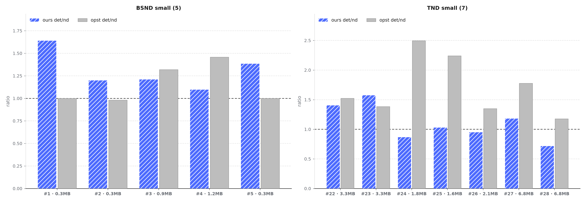
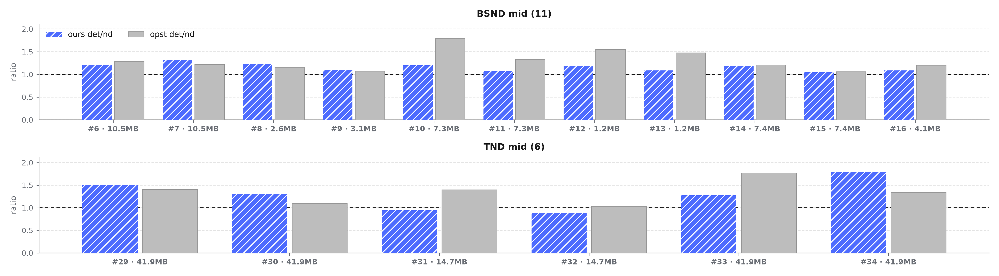
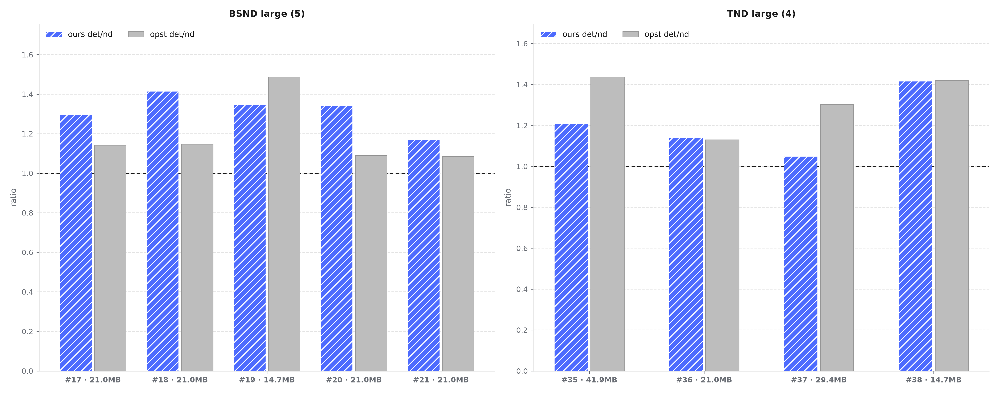
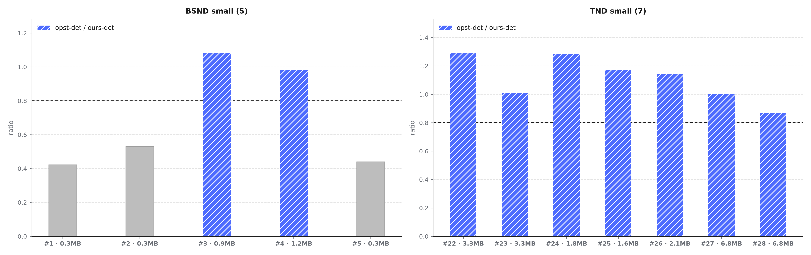
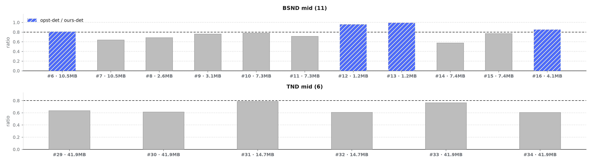
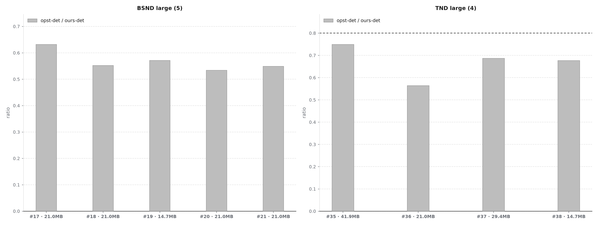
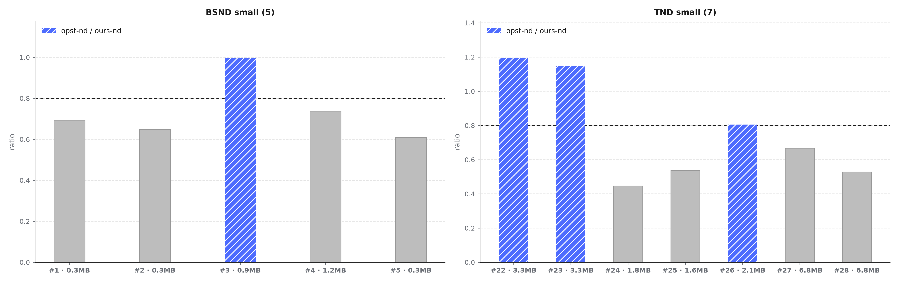
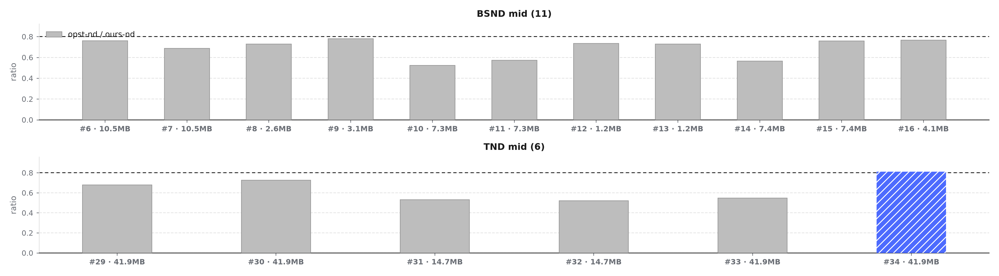
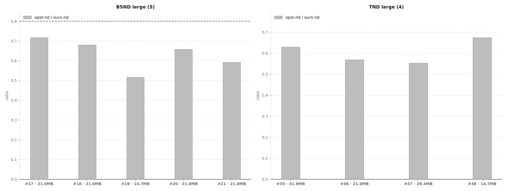

# PR：确定性反向（BN2S2 + TND causal 调度）性能对比与分析

> 2026-09-16 刷新：本次数据在 **late-wait 轮屏障**（`1909a89`）之上重测，
> 含 v3.1（idle-core trim + tiny 单块 causal 改 dense）与 v3.2（late-wait）两个
> 增量。与上一版（`02c043b`）相比：det-vs-det 0.741→**0.825**（达标率 34%→**50%**），
> 确定性开销 1.193→**1.076**（opst 1.320→1.319， ours≤opst 23→**31**/38）。

源分支：`det-cmp-v3.2-swizzle`（HEAD `1909a89`，= `det-cmp-v3-swizzle@02c043b` + v3.1 + v3.2）
目标分支：`integration/FAG-V3-A5`（基线 `13e835c`「cube Optimize」已并入，PR 无冲突）

## Related Issue

支持 FAG v3（Ascend950）反向的**确定性分支**（deterministic bwd）：补齐 TND
causal 专用调度与 TND ragged flat 分区，并完成与 ops-transformer（opst）的性能
对齐。（仓库内无对应 issue 编号）

## Summary

本 PR 让 `deterministic=True` 的反向覆盖下列布局，并给出与 ops-transformer 的
达标情况。口径：msprof device 侧 kernel 时间（`Task Duration`），**median of 25**
（warmup 5 + repeat 20）；比值 = opst / 本实现，**≥0.8 达标**。

**支持的布局**

| 维度 | 覆盖 |
|---|---|
| layout | BSND（dense / causal）、TND（dense / causal，含 ragged / 不等长分段） |
| head 结构 | MHA / GQA / MQA（n2 = 1~8，g = 1~4） |
| head dim | 64 / 128 |
| 形状 | 方阵、矩形（sq ≠ sk）、非对齐尺寸（如 33×77）、奇 batch |
| 前提 | `deterministic=True` 走 BN2S2 调度（`mha_bwd.cpp` 显式校验） |

**每种布局的性能达标情况**（38 case = BSND 21 + TND 17）

| layout | 确定性 vs 确定性 | 小 shape | 中 shape | 大 shape | 非确定性 vs 非确定性 | 确定性开销 ours / opst |
|---|---|---|---|---|---|---|
| BSND | 0.781（43%） | 0.809（40%） | 0.816（64%） | 0.683（0%） | 0.688（10%） | 1.081 / 1.227 |
| TND | **0.883（59%）** | **1.109（100%）** | 0.773（33%） | 0.723（25%） | 0.655（12%） | **1.069 / 1.441** |
| 合计 | **0.825（50%）** | — | — | — | 0.673（11%） | **1.076 / 1.319**（31/38 个开销 ≤ opst） |

一句话：确定性开销整体显著优于 opst（**1.076 vs 1.319**，31/38 个逐 case 更低）；
确定性核时 TND 整体 0.883（小档反超 1.109），BSND 中档 0.816、大档 0.683；
剩余差距几乎全部来自**共享主流水（nd）**（0.673，与确定性改动无关，见
Profiling 结论）。late-wait 轮屏障（v3.2）把 det 的轮级排序开销压到 opst 之下。

## Validation

### 性能对比：确定性开销

倍率 = det 核时 / nd 核时（>1 = det 更慢）；虚线 = 1.0；横轴 = case 序号 · 数据量
（MB）。蓝纹 = 本实现，灰 = opst。

**小 shape**

**中 shape**

**大 shape**

| 分组 | case 数 | 小 shape | 中 shape | 大 shape |
|---|---:|---:|---:|---:|
| BSND | 21 | 1.036 / 1.135 | 1.094 / 1.287 | 1.101 / 1.195 |
| TND | 17 | 1.050 / 1.647 | 1.076 / 1.331 | 1.093 / 1.285 |

跨档合并（38 case）：ours **1.076** / opst 1.319；逐 case 比较 **31/38** 个本实现开销 ≤ opst。

### 性能对比：确定性 vs 确定性

比值 = opst / 本实现（≥0.8 达标，<0.8 的柱标灰）；虚线 = 0.8 目标线。

**小 shape**

**中 shape**

**大 shape**

| 分组 | case 数 | 小 shape | 中 shape | 大 shape |
|---|---:|---:|---:|---:|
| BSND | 21 | 0.809（40%） | 0.816（64%） | 0.683（0%） |
| TND | 17 | **1.109（100%）** | 0.773（33%） | 0.723（25%） |

### 性能对比：非确定性 vs 非确定性

比值 = opst-nd / 本实现-nd（≥0.8 达标）；该差距为目标主流水既有问题，与本 PR 的
确定性改动无关。

**小 shape**

**中 shape**

**大 shape**

| 分组 | case 数 | 小 shape | 中 shape | 大 shape |
|---|---:|---:|---:|---:|
| BSND | 21 | 0.738（20%） | 0.694（9%） | 0.629（0%） |
| TND | 17 | 0.707（29%） | 0.625（0%） | 0.614（0%） |

### vs. ops-transformer 性能对比明细

逐 case 全矩阵（核时 µs，median of 25）；`ours det/nd` 与 `opst det/nd` 为
确定性开销倍率，`det ratio` / `nd ratio` = opst / 本实现（**加粗** = 双方更优的 det / nd 核时；
ratio 列中 ≥ 0.8 达标的用**粗体**，未达标为常规）。

| # | case | shape (b n g s2 s1 d causal/dense) | ours det | ours nd | opst det | opst nd | ours det/nd | opst det/nd | det ratio | nd ratio |
|---|---|---|---:|---:|---:|---:|---:|---:|---:|---:|
| 1 | bsnd_small_mha_causal | b1 n2 g1 s2=128 s1=128 d128 causal | 16.6 | 15.3 | **10.4** | **10.3** | 1.08 | 1.01 | 0.63 | 0.68 |
| 2 | bsnd_small_mha_nc | b1 n2 g1 s2=128 s1=128 d128 dense | 16.3 | 14.7 | **10.0** | **10.0** | 1.11 | 1.00 | 0.62 | 0.68 |
| 3 | bsnd_small_gqa_tail_causal | b2 n2 g2 s2=300 s1=200 d64 causal | **21.4** | 20.3 | 26.3 | **20.6** | 1.05 | 1.28 | **1.23** | **1.01** |
| 4 | bsnd_small_mqa_tail_nc | b2 n1 g4 s2=500 s1=300 d64 dense | **32.5** | 30.7 | 34.6 | **23.5** | 1.06 | 1.47 | **1.07** | 0.76 |
| 5 | bsnd_tiny_unaligned_causal | b2 n4 g1 s2=77 s1=33 d64 causal | 12.9 | 14.4 | **8.8** | **8.9** | 0.89 | 0.99 | 0.68 | 0.62 |
| 6 | bsnd_mid_mha_square_causal | b1 n8 g1 s2=1024 s1=1024 d128 causal | 68.5 | 62.6 | **57.3** | **47.3** | 1.09 | 1.21 | **0.84** | 0.76 |
| 7 | bsnd_mid_mha_square_nc | b1 n8 g1 s2=1024 s1=1024 d128 dense | 96.8 | 81.6 | **70.5** | **58.1** | 1.19 | 1.21 | 0.73 | 0.71 |
| 8 | bsnd_mid_mha_rect_causal | b2 n4 g1 s2=777 s1=333 d64 causal | 39.0 | 32.9 | **27.1** | **23.2** | 1.19 | 1.17 | 0.69 | 0.71 |
| 9 | bsnd_mid_mha_rect_nc | b2 n4 g1 s2=333 s1=777 d64 dense | 34.6 | 33.2 | **28.7** | **27.7** | 1.04 | 1.04 | **0.83** | **0.83** |
| 10 | bsnd_mid_gqa_square_causal | b1 n2 g4 s2=1024 s1=1024 d128 causal | 94.4 | 81.7 | **77.1** | **43.6** | 1.15 | 1.77 | **0.82** | 0.53 |
| 11 | bsnd_mid_gqa_square_nc | b1 n2 g4 s2=1024 s1=1024 d128 dense | 99.3 | 95.6 | **75.1** | **55.9** | 1.04 | 1.34 | 0.76 | 0.59 |
| 12 | bsnd_mid_mqa_causal | b2 n1 g4 s2=500 s1=300 d64 causal | **33.9** | 30.4 | 35.3 | **22.2** | 1.12 | 1.59 | **1.04** | 0.73 |
| 13 | bsnd_mid_mqa_nc | b2 n1 g4 s2=500 s1=300 d64 dense | **32.5** | 31.3 | 34.8 | **23.0** | 1.04 | 1.51 | **1.07** | 0.74 |
| 14 | bsnd_mid_gqa_rect_causal | b2 n3 g2 s2=900 s1=500 d128 causal | 61.2 | 56.6 | **39.3** | **32.3** | 1.08 | 1.22 | 0.64 | 0.57 |
| 15 | bsnd_mid_gqa_rect_nc | b2 n3 g2 s2=900 s1=500 d128 dense | 62.7 | 63.9 | **51.5** | **48.0** | 0.98 | 1.07 | **0.82** | 0.75 |
| 16 | bsnd_mid_mha_hd64_nc | b2 n3 g2 s2=333 s1=777 d64 dense | 43.8 | 38.6 | **37.1** | **30.4** | 1.14 | 1.22 | **0.85** | 0.79 |
| 17 | bsnd_long_mha_causal | b1 n8 g1 s2=2048 s1=2048 d128 causal | 157.2 | 146.0 | **122.5** | **104.5** | 1.08 | 1.17 | 0.78 | 0.72 |
| 18 | bsnd_long_mha_nc | b1 n8 g1 s2=2048 s1=2048 d128 dense | 270.2 | 229.8 | **178.1** | **157.6** | 1.18 | 1.13 | 0.66 | 0.69 |
| 19 | bsnd_long_gqa_causal | b1 n2 g4 s2=2048 s1=2048 d128 causal | 225.3 | 183.8 | **141.8** | **97.8** | 1.23 | 1.45 | 0.63 | 0.53 |
| 20 | bsnd_large_mha_causal | b1 n4 g1 s2=4096 s1=4096 d128 causal | 279.3 | 251.4 | **184.8** | **164.0** | 1.11 | 1.13 | 0.66 | 0.65 |
| 21 | bsnd_large_mha_nc | b1 n4 g1 s2=4096 s1=4096 d128 dense | **442.0** | 471.3 | **306.0** | **271.7** | 0.94 | 1.13 | 0.69 | 0.58 |
| 22 | tnd_small_mha_causal | b2 n4 g1 s2=256+384 s1=256+384 d128 causal | **29.6** | **21.6** | 38.5 | 24.9 | 1.37 | 1.55 | **1.30** | **1.15** |
| 23 | tnd_small_mha_nc | b2 n4 g1 s2=256+384 s1=256+384 d128 dense | **36.0** | **23.8** | 36.4 | 26.5 | 1.51 | 1.37 | **1.01** | **1.11** |
| 24 | tnd_ragged_mqa_causal | b2 n1 g4 s2=300+1300 s1=100+800 d64 causal | **56.3** | 63.7 | 72.1 | **29.3** | 0.89 | 2.46 | **1.28** | 0.46 |
| 25 | tnd_ragged_mqa_nc | b2 n1 g4 s2=300+400 s1=100+800 d64 dense | **54.0** | 52.1 | 61.8 | **27.6** | 1.04 | 2.23 | **1.14** | 0.53 |
| 26 | tnd_ragged_mha_nc | b2 n4 g1 s2=300+400 s1=100+800 d64 dense | **32.4** | 36.2 | 38.6 | **28.6** | 0.89 | 1.35 | **1.19** | 0.79 |
| 27 | tnd_ragged_gqa_causal | b2 n2 g2 s2=768+1280 s1=512+1024 d128 causal | **64.0** | 57.3 | 65.8 | **37.2** | 1.12 | 1.77 | **1.03** | 0.65 |
| 28 | tnd_ragged_gqa_nc | b2 n2 g2 s2=768+1280 s1=512+1024 d128 dense | 68.0 | 91.2 | **59.5** | **50.5** | 0.75 | 1.18 | **0.88** | 0.55 |
| 29 | tnd_eq_mha_causal | b2 n8 g1 s2=2048 s1=2048 d128 causal | 316.7 | 275.1 | **248.4** | **176.9** | 1.15 | 1.40 | 0.78 | 0.64 |
| 30 | tnd_eq_mha_nc | b2 n8 g1 s2=2048 s1=2048 d128 dense | 494.4 | 465.3 | **396.1** | **325.1** | 1.06 | 1.22 | **0.80** | 0.70 |
| 31 | tnd_eq_gqa_causal | b2 n2 g4 s2=1024 s1=1024 d128 causal | 112.3 | 119.7 | **89.6** | **70.9** | 0.94 | 1.26 | **0.80** | 0.59 |
| 32 | tnd_eq_gqa_nc | b2 n2 g4 s2=1024 s1=1024 d128 dense | 132.3 | 171.3 | **93.1** | **89.9** | 0.77 | 1.04 | 0.70 | 0.53 |
| 33 | tnd_pack8_mha_causal | b8 n8 g1 s2=512 s1=512 d128 causal | 168.2 | 152.1 | **156.2** | **86.0** | 1.11 | 1.82 | **0.93** | 0.57 |
| 34 | tnd_pack8_mha_nc | b8 n8 g1 s2=512 s1=512 d128 dense | 275.6 | 173.7 | **179.1** | **130.9** | 1.59 | 1.37 | 0.65 | 0.75 |
| 35 | tnd_large4_mha_causal | b4 n4 g1 s2=2048 s1=2048 d128 causal | 301.8 | 280.5 | **258.3** | **178.4** | 1.08 | 1.45 | **0.86** | 0.64 |
| 36 | tnd_large_mha_nc | b1 n4 g1 s2=4096 s1=4096 d128 dense | **448.8** | 471.2 | **304.1** | **271.2** | 0.95 | 1.12 | 0.68 | 0.58 |
| 37 | tnd_large4_gqa_causal | b4 n2 g4 s2=1024 s1=1024 d128 causal | 214.2 | 200.1 | **141.7** | **114.6** | 1.07 | 1.24 | 0.66 | 0.57 |
| 38 | tnd_large4_mqa_causal | b4 n1 g4 s2=2048 s1=2048 d64 causal | 255.1 | 196.3 | **181.4** | **133.4** | 1.30 | 1.36 | 0.71 | 0.68 |
| GM | BSND |  | 62.1 | 57.4 | **48.4** | **39.5** | 1.08 | 1.23 | 0.78 | 0.69 |
| pass | BSND |  |  |  |  |  |  |  | 43% | 10% |
| GM | TND |  | 123.5 | 115.5 | **109.1** | **75.7** | 1.07 | 1.44 | **0.88** | 0.66 |
| pass | TND |  |  |  |  |  |  |  | 59% | 12% |

### Profiling：BSND（0.26MB → 41.9MB，五档典型案例）

shape：1) 0.26MB 2×33×77 H4/4 D64 causal　2) 0.33MB 1×128×128 H2/2 D128 causal　
3) 0.92MB 2×200×300 H4/2 D64 causal　4) 10.5MB 1×1024² H8 D128 dense　
5) 41.9MB 1×4096² H4 D128 causal

| case | 实现 | duration | MAC | MTE2 | MTE1 | fixpipe | scal_c | vec | scal_v | cube% |
|---|---|---|---:|---:|---:|---:|---:|---:|---:|---:|
| 0.26MB | 本仓库 det | 13.2 | 0.4 | 0.6 | 0.3 | 0.8 | 5.3 | 1.2 | 6.3 | 26.0 |
| 0.26MB | 本仓库 nd | 14.4 | 0.1 | 0.2 | 0.1 | 0.4 | 4.5 | 0.6 | 6.2 | 84.7 |
| 0.26MB | opst det | 8.9 | 0.4 | 0.5 | 0.3 | 2.1 | 6.8 | 0.7 | 5.5 | 25.8 |
| 0.26MB | opst nd | 8.9 | 0.4 | 0.5 | 0.3 | 2.1 | 6.7 | 0.7 | 5.6 | 25.7 |
| 0.33MB | 本仓库 det | 16.2 | 1.9 | 1.4 | 1.0 | 1.9 | 4.9 | 2.9 | 5.9 | 6.5 |
| 0.33MB | 本仓库 nd | 15.4 | 0.1 | 0.1 | 0.1 | 0.2 | 4.0 | 0.6 | 5.8 | 85.5 |
| 0.33MB | opst det | 10.4 | 1.8 | 1.4 | 0.9 | 4.5 | 5.9 | 1.5 | 4.8 | 6.7 |
| 0.33MB | opst nd | 10.4 | 1.8 | 1.5 | 0.9 | 4.5 | 5.9 | 1.5 | 4.8 | 6.7 |
| 0.92MB | 本仓库 det | 20.7 | 2.7 | 3.6 | 1.8 | 4.0 | 9.4 | 4.1 | 9.1 | 38.6 |
| 0.92MB | 本仓库 nd | 20.4 | 1.1 | 1.1 | 0.8 | 1.5 | 5.3 | 2.0 | 6.6 | 88.8 |
| 0.92MB | opst det | 26.7 | 0.7 | 0.4 | 0.5 | 2.6 | 12.5 | 1.0 | 8.8 | 83.1 |
| 0.92MB | opst nd | 20.6 | 1.0 | 1.2 | 0.7 | 6.4 | 12.3 | 1.2 | 7.8 | 62.8 |
| 10.5MB | 本仓库 det | 96.3 | 40.2 | 38.8 | 23.2 | 49.5 | 35.8 | 24.2 | 26.9 | 75.9 |
| 10.5MB | 本仓库 nd | 82.2 | 32.4 | 24.1 | 18.6 | 30.0 | 20.2 | 18.9 | 13.6 | 92.4 |
| 10.5MB | opst det | 72.7 | 35.9 | 15.1 | 20.6 | 41.9 | 28.8 | 20.2 | 23.4 | 88.4 |
| 10.5MB | opst nd | 58.1 | 36.5 | 13.5 | 22.2 | 42.0 | 27.1 | 16.6 | 19.0 | 83.6 |
| 41.9MB | 本仓库 det | 278.7 | 162.0 | 136.0 | 93.4 | 184.0 | 133.6 | 95.3 | 110.4 | 77.4 |
| 41.9MB | 本仓库 nd | 250.4 | 129.2 | 53.5 | 73.1 | 84.5 | 65.7 | 74.3 | 40.3 | 95.3 |
| 41.9MB | opst det | 178.5 | 136.3 | 85.0 | 81.2 | 133.8 | 94.2 | 79.2 | 91.1 | 93.1 |
| 41.9MB | opst nd | 170.3 | 131.0 | 55.3 | 82.8 | 143.6 | 75.5 | 60.2 | 67.4 | 93.1 |

- 0.26 / 0.33 MB：各 pipe ≤4µs，duration 13–16µs，固定开销（启动 + 序言标量）
  仍占主导；v3.1 后 tiny causal 的 det 已快于 nd（det/nd 0.89–0.94），
  与 opst 的差距从 2.3–2.4× 收敛到 1.3–1.6×；
- 0.92 MB 起 det 占优（1.23× / 1.07×）；中/大档 det 与 nd 的差距已收窄
  （late-wait 后轮序开销大部隐藏），剩余差距集中在 nd 主流水（见结论）。

### Profiling：TND causal（小 / 中 / 大典型案例）

shape：1) 小 2 段 256+384 H4 D128　2) 中 2×2048 H8 D128　3) 大 4×2048 H4 D128
（均 causal；数据量 3.3MB / 41.9MB / 41.9MB）

| case | 实现 | duration | MAC | MTE2 | MTE1 | fixpipe | scal_c | vec | scal_v | cube% |
|---|---|---|---:|---:|---:|---:|---:|---:|---:|---:|
| 小 | 本仓库 det | 30.7 | 2.4 | 2.4 | 1.4 | 3.0 | 8.1 | 2.7 | 9.4 | 89.8 |
| 小 | 本仓库 nd | 22.0 | 2.5 | 1.5 | 1.4 | 2.6 | 5.7 | 2.7 | 7.0 | 86.1 |
| 小 | opst det | 38.6 | 2.7 | 1.3 | 1.5 | 5.0 | 19.9 | 1.8 | 12.0 | 83.4 |
| 小 | opst nd | 25.4 | 4.6 | 2.0 | 2.3 | 10.6 | 13.4 | 2.8 | 9.6 | 50.2 |
| 中 | 本仓库 det | 308.6 | 142.8 | 150.3 | 81.7 | 195.3 | 125.5 | 85.1 | 106.0 | 90.4 |
| 中 | 本仓库 nd | 278.1 | 146.6 | 68.6 | 83.2 | 96.8 | 77.5 | 85.6 | 44.6 | 86.7 |
| 中 | opst det | 259.8 | 165.4 | 121.3 | 85.4 | 174.3 | 103.0 | 84.0 | 95.7 | 88.5 |
| 中 | opst nd | 174.3 | 128.9 | 54.9 | 82.8 | 143.7 | 93.1 | 64.9 | 88.0 | 95.3 |
| 大 | 本仓库 det | 317.7 | 142.0 | 159.8 | 81.5 | 197.7 | 128.0 | 85.2 | 106.2 | 90.8 |
| 大 | 本仓库 nd | 279.7 | 143.2 | 74.6 | 81.8 | 100.9 | 75.9 | 85.0 | 44.6 | 88.7 |
| 大 | opst det | 266.8 | 170.4 | 126.4 | 84.8 | 178.6 | 102.8 | 84.3 | 96.2 | 88.9 |
| 大 | opst nd | 175.3 | 129.3 | 55.1 | 83.4 | 144.3 | 93.7 | 65.0 | 88.3 | 95.0 |

- 小档（3.3MB）本实现占优：实测 nd 1.15×、det 1.30×；
- 中/大档：det 与 opst det 的差距（309 vs 260、318 vs 267）已**小于** nd 与
  opst nd 的差距（278 vs 174、280 vs 175）——det 专项已无独立空间。

### Profiling 结论与优化优先级

| 观察 | 证据 | 判断 | 行动 |
|---|---|---|---|
| det 开销已优于 opst | 38 case：ours det/nd 1.076 vs opst 1.319，31/38 逐 case 更低；late-wait 前后 TND 代表 case 的轮屏障税（每轮 1~2.5µs × 55~128 轮）回收 60~76% | **det 专项收官** | 维护位级回归即可 |
| nd 主流水（共同瓶颈） | TND 中/大 nd：duration 278 / 280 vs opst 174 / 175（1.6×），但 MTE2、fixpipe、scal_c 均更低；BSND 41.9MB nd 同理（250 vs 170）；cube% 87–95 而 MAC 仅占一半 | 每 task 依赖链（S→P→dS→dq/dk/dv）的跨引擎串联延迟未被 1 层前瞻（TASK_PINGPONG=2）掩盖 | ① 主流水加深/重叠改造（结构项，需槽位重排，L1 512KB 已满） |
| 极小 shape（0.26–0.33MB）仍落后 | det 16.2 vs 10.4、nd 15.4 vs 10.4；全部 pipe ≤4µs、MAC ≤2µs | 固定开销（启动 + 序言标量），v3.1 已从 2.3–2.4× 收到 ~1.5× | ④ 序言精简专项（低优先级） |
| ≥0.9MB det 已占优或持平 | 0.92MB det 1.23×；TND 3.3MB det 1.30× | 规模摊薄固定开销 | 维持现状 |

**测量方法学备注**：det 测量对机器状态敏感（同二进制跨时段漂移 5~20µs），
本版全部 det 侧优化结论均经"逐 case 交错 A/B"（bench_ab2.py，两 build 目录
交替跑同一 case）验证；表内数值为单次 median of 25，跨表小幅（±3%）差异属正常。

## Additional Information

- **测试覆盖**：`tests/test_flash_attn_npu_v3_bwd_det.py` 38 case（BSND 21 + TND 17），
  每 case 跑 det 与 nondet 两条路径，校验 golden 一致、det 多次调用逐位一致、
  det 与 nd 互验；causal 用例按每 batch `sq ≤ sk` 生成（否则 golden 自身退化 NaN）。
- **对比对象的可运行边界**：opst 的 TND causal 要求 `atten_mask` 的 Skv 恰为 2048，
  单段长度 > 2048 的 causal 用例 opst 无法运行（明细表中记为空缺）。
- **确定性前提**：`deterministic=True` 必须落到 BN2S2 调度（有显式校验，不再回退
  旧流内方案）；非确定路径保持原实例化（`09b51d6` 隔离）。
- **关键实现增量（v3.2，late-wait 轮屏障）**：BN2S2 的轮级 mode-0 fix 屏障原先把
  每轮前端（C1/C2/C5）挡在 40 核 rendezvous 之后；改为 SET 仍在轮末、WAIT 延后
  一轮并落在上一轮奇偶对应的 flag（10/15 交替）上——MHA 仅 C34（dq 原子加）前
  等待、GQA/TND-flat 在 C5（dv 亦有序）前等待，空轮照等保持代际对齐；排序语义
  不变（轮 r 的有序写仍严格晚于全部核的轮 r−1 写），38 case 位级验证全过。
- **v3.1 增量**：idle-core trim（小 shape 按调度所需最小核数启动）+ 单块方格
  causal 改 dense 调度，小档 det ratio 0.637→0.809，tiny causal det 快于 nd。
- **极小档与中/大档结论相反**：0.92 MB 起 det 占优，而 0.26–0.33 MB 档因固定开销
  仍落后（~1.5×，已大幅收敛）；引用"小 shape 已占优"时需注明档位。
- **nd 差距的来源**：合并目标「cube Optimize」后 nd 与纯目标构建一致（A/B 对照通过），
  该差距为分支既有主流水问题，非本 PR 引入；目标自身的优化亦使部分 mid nd shape
  变慢（GQA s1024 nc 69→93 µs、square nc 73→82、rect 28→33）。
- **FWD 侧已知问题（仅记录，不影响本 PR 的 bwd 接口）**：`flash_attn_func` /
  `flash_attn_varlen_func` 返回的 `softmax_lse` 目前为 `+inf`（fwd 未落地 lse
  写出），走 autograd 端到端时梯度会全 0；直接调用 bwd 接口（传入合法 lse）
  不受影响。基线分支同样存在。
- 数据源：`/data/g00977778/tmp-prof/latewait_{ours,opst}.csv`（全矩阵，median of 25），
  汇总脚本 `latewait_summary.py`、图表 `latewait_figs.py`、分 pipe 采集
  `latewait_pipes{,_opst}.py`；优化过程与消融记录见
  `.docs/scratch/v32_pipeline_probe.md`。
